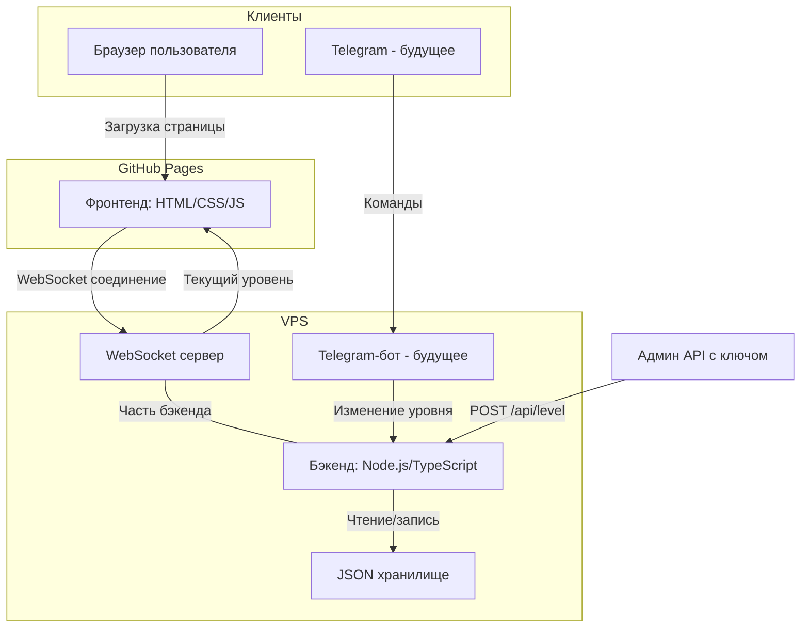
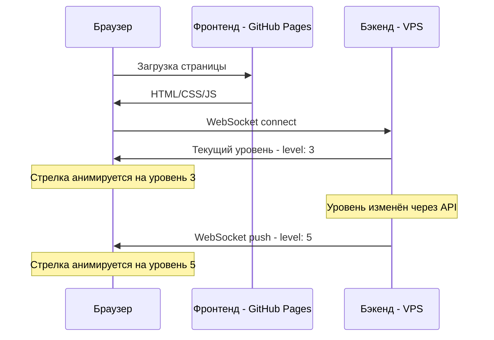
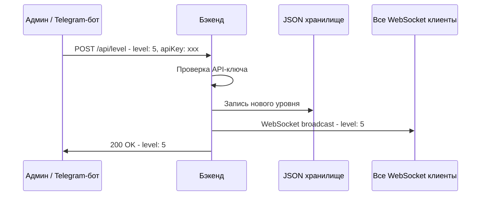

# Чувствометр — Архитектура приложения

## Обзор

**Чувствометр** — шуточное веб-приложение, отображающее спидометр-подобный виджет с 7 уровнями чувств. Уровень динамически управляется через бэкенд и обновляется на фронтенде в реальном времени через WebSocket.

## Стек технологий

| Компонент | Технология | Обоснование |
|-----------|-----------|-------------|
| Фронтенд | HTML5 + CSS3 + Vanilla JS | Простота, деплой на GitHub Pages без сборки |
| Бэкенд | Node.js + TypeScript + Express | Предпочтение заказчика, типизация |
| WebSocket | ws (библиотека) | Лёгкая, нативная реализация для Node.js |
| Хранилище | JSON-фа��л | Хранится один параметр — уровень чувств |
| Telegram-бот | node-telegram-bot-api (будущее) | Популярная библиотека для Telegram Bot API |
| Деплой фронта | GitHub Pages | Красивый домен username.github.io/chuvstvometr |
| Деплой бэка | VPS (виртуальный сервер) | Полный контроль, WebSocket поддержка |

## Архитектура системы



## Модули системы

### 1. Фронтенд (frontend/)

Статическая HTML-страница с SVG-спидометром, которая:
- Подключается к бэкенду по WebSocket при загрузке
- Получает текущий уровень чувств
- Анимированно перемещает стрелку на нужный сектор
- Автоматически обновляется при изменении уровня через WebSocket
- Имеет fallback на HTTP polling если WebSocket недоступен

**Файловая структур��:**
```
frontend/
  index.html        — основная страница
  css/
    style.css       — стили приложения
  js/
    gauge.js        — логика отрисовки спидометра (SVG)
    websocket.js    — WebSocket клиент с reconnect
    app.js          — точка входа, инициализация
  assets/
    favicon.ico     — иконка
```

### 2. Бэкенд (backend/)

Node.js/TypeScript сервер с Express и WebSocket:
- REST API для чтения и изменения уровня
- WebSocket сервер для push-уведомлений клиентам
- Авторизация через API-ключ для изменения уровня
- JSON-файл для персистентного хранения состояния

**Файловая структура:**
```
backend/
  src/
    index.ts          — точка входа, запуск сервера
    config.ts         — конфигурация (порт, API-ключ, CORS)
    routes/
      level.ts        — маршруты API для уровня чувств
    services/
      storage.ts      — сер��ис чтения/записи JSON-файла
      websocket.ts    — WebSocket сервер и broadcast
    types/
      index.ts        — типы и интерфейсы
    middleware/
      auth.ts         — проверка API-ключа
      cors.ts         — CORS настройки
  data/
    state.json        — файл хранения текущего состояния
  package.json
  tsconfig.json
  .env.example        — пример переменных окружения
```

### 3. Telegram-бот (будущее, bot/)

Отдельный модуль или часть бэкенда:
- Принимает команды от авторизованных пользователей
- Вызывает внутренний API бэкенда для изменения уровня
- Может показывать текущий уровень

## Уровни чув��тв

| Уровень | Цвет | HEX-код | Описание |
|---------|------|---------|----------|
| 1 | Серый | #9E9E9E | Минимальный уровень |
| 2 | Белый | #F5F5F5 | Нейтральный |
| 3 | Жёлтый | #FFEB3B | Лёгкое тепло |
| 4 | Оранжевый | #FF9800 | Заметное тепло |
| 5 | Красный | #F44336 | Горячо |
| 6 | Малиновый | #E91E63 | Очень горячо |
| 7 | Клубничный | #FF1744 | Максимум |

## Потоки данных

### Получение текущего уровня (фронтенд)



### Изменение уровня (админ)



## Безопасность

- **API-ключ**: Все ��утирующие запросы (POST/PUT) требуют заголовок `X-API-Key`
- **CORS**: Настроен для разрешения запросов только с домена GitHub Pages
- **WebSocket**: Только чтение для клиентов, изменение только через REST API
- **Rate limiting**: Базовое ограничение частоты запросов на бэкенде

## Отказоустойчивость

- **WebSocket reconnect**: Клиент автоматически переподключается при разрыве соединения
- **HTTP fallback**: Если WebSocket недоступен, фронтенд переключается на polling каждые 10 секунд
- **Graceful degradation**: При недоступности бэке��да фронтенд показывает последнее известное значение
