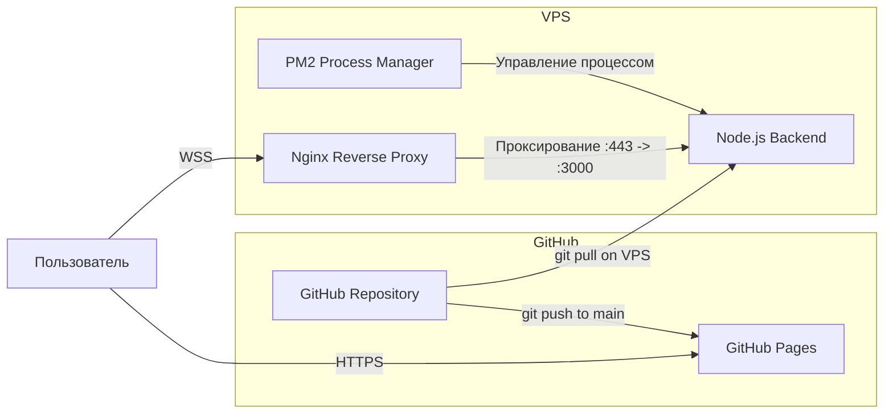

# Чувствометр — План деплоя

## Обзор инфраструктуры



## 1. Деплой фронтенда — GitHub Pages

### Настройка репозитория

1. Фронтенд находится в директории `frontend/` репозитория
2. В настройках GitHub репозитория: Settings → Pages → Source → Deploy from a branch
3. Ветка: `main`, директория: `/frontend` (или использовать GitHub Actions для деплоя из поддиректории)

### GitHub Actions workflow

Создать файл `.github/workflows/deploy-frontend.yml`:

```yaml
name: Deploy Frontend to GitHub Pages

on:
  push:
    branches: [main]
    paths: [frontend/**]

jobs:
  deploy:
    runs-on: ubuntu-latest
    permissions:
      pages: write
      id-token: write
    environment:
      name: github-pages
      url: ${{ steps.deployment.outputs.page_url }}
    steps:
      - uses: actions/checkout@v4
      - uses: actions/configure-pages@v4
      - uses: actions/upload-pages-artifact@v3
        with:
          path: frontend
      - id: deployment
        uses: actions/deploy-pages@v4
```

### Результат

Фронтенд будет доступен по адресу:
```
https://<username>.github.io/chuvstvometr/
```

## 2. Деплой бэкенда — VPS

### Предварительные требования на VPS

- Node.js 20+ (через nvm)
- npm или yarn
- PM2 (менеджер процессов)
- Nginx (reverse proxy + SSL)
- Certbot (Let's Encrypt SSL)

### Установка зависимостей на VPS

```bash
# Node.js через nvm
curl -o- https://raw.githubusercontent.com/nvm-sh/nvm/v0.39.7/install.sh | bash
nvm install 20
nvm use 20

# PM2
npm install -g pm2

# Nginx и Certbot
sudo apt update
sudo apt install nginx certbot python3-certbot-nginx
```

### Клонирование и сборка

```bash
# Клонирование репозитория
cd /opt
git clone https://github.com/<username>/chuvstvometr.git
cd chuvstvometr/backend

# Установка зависимостей
npm install

# Сборка TypeScript
npm run build

# Создание .env файла
cp .env.example .env
nano .env  # заполнить реальные значения
```

### Настройка PM2

```bash
# Запуск приложения
pm2 start dist/index.js --name chuvstvometr-backend

# Автозапуск при перезагрузке сервера
pm2 startup
pm2 save
```

Или через ecosystem файл `backend/ecosystem.config.js`:

```javascript
module.exports = {
  apps: [{
    name: 'chuvstvometr-backend',
    script: './dist/index.js',
    cwd: '/opt/chuvstvometr/backend',
    env: {
      NODE_ENV: 'production'
    },
    instances: 1,
    autorestart: true,
    max_memory_restart: '200M',
  }]
};
```

### Настройка Nginx

Файл `/etc/nginx/sites-available/chuvstvometr`:

```nginx
server {
    listen 80;
    server_name api.chuvstvometr.example.com;
    return 301 https://$server_name$request_uri;
}

server {
    listen 443 ssl;
    server_name api.chuvstvometr.example.com;

    ssl_certificate /etc/letsencrypt/live/api.chuvstvometr.example.com/fullchain.pem;
    ssl_certificate_key /etc/letsencrypt/live/api.chuvstvometr.example.com/privkey.pem;

    # REST API
    location /api/ {
        proxy_pass http://127.0.0.1:3000;
        proxy_http_version 1.1;
        proxy_set_header Host $host;
        proxy_set_header X-Real-IP $remote_addr;
        proxy_set_header X-Forwarded-For $proxy_add_x_forwarded_for;
        proxy_set_header X-Forwarded-Proto $scheme;
    }

    # WebSocket
    location /ws {
        proxy_pass http://127.0.0.1:3000;
        proxy_http_version 1.1;
        proxy_set_header Upgrade $http_upgrade;
        proxy_set_header Connection "upgrade";
        proxy_set_header Host $host;
        proxy_set_header X-Real-IP $remote_addr;
        proxy_read_timeout 86400;
    }
}
```

```bash
# Активация конфигурации
sudo ln -s /etc/nginx/sites-available/chuvstvometr /etc/nginx/sites-enabled/
sudo nginx -t
sudo systemctl reload nginx

# SSL сертификат
sudo certbot --nginx -d api.chuvstvometr.example.com
```

### Обновление бэкенда

Скрипт `backend/scripts/deploy.sh`:

```bash
#!/bin/bash
cd /opt/chuvstvometr
git pull origin main
cd backend
npm install
npm run build
pm2 restart chuvstvometr-backend
echo "Deploy complete!"
```

## 3. Переменные окружения

### Production (.env на VPS)

```env
PORT=3000
API_KEY=<сгенерировать-надёжный-ключ>
CORS_ORIGINS=https://<username>.github.io
STATE_FILE=./data/state.json
LOG_LEVEL=info
NODE_ENV=production
```

### Development (.env.development)

```env
PORT=3000
API_KEY=dev-key-12345
CORS_ORIGINS=http://localhost:8080,http://127.0.0.1:8080
STATE_FILE=./data/state.json
LOG_LEVEL=debug
NODE_ENV=development
```

## 4. Локальная разработка

```bash
# Терминал 1: Бэкенд
cd backend
npm install
npm run dev  # ts-node с nodemon

# Терминал 2: Фронтенд (простой HTTP-сервер)
cd frontend
npx serve .  # или python -m http.server 8080
```

## 5. Чеклист деплоя

- [ ] Создать GitHub репозиторий
- [ ] Настроить GitHub Pages для директории frontend
- [ ] Создать GitHub Actions workflow для автодеплоя фронтенда
- [ ] Подготовить VPS: установить Node.js, PM2, Nginx
- [ ] Клонировать репозиторий на VPS
- [ ] Настроить .env на VPS
- [ ] Собрать и запустить бэкенд через PM2
- [ ] Настроить Nginx reverse proxy с SSL
- [ ] Обновить URL бэкенда в конфиге фронтенда
- [ ] Проверить WebSocket соединение через HTTPS/WSS
- [ ] Проверить CORS настройки
- [ ] Протестировать API с API-ключом
