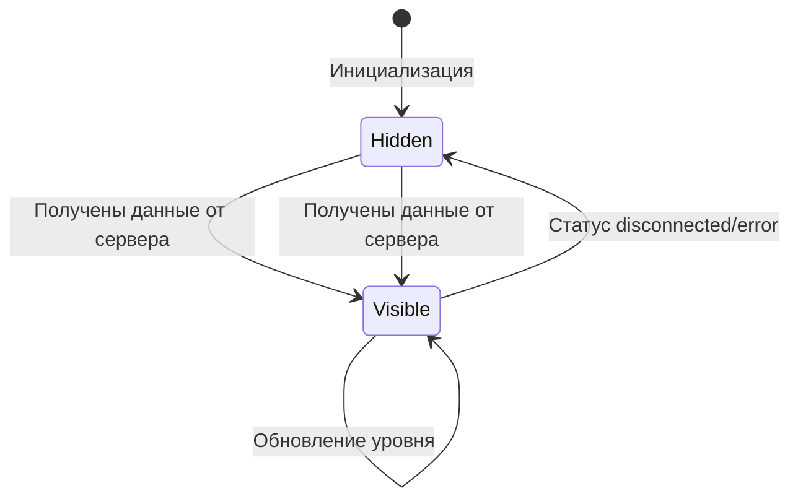

# План доработок спидометра Чувствометра

## Доработка 1: Убрать цифры с секторов спидометра

### Проблема
На секторах спидометра отображаются цифры 1-7, которые нужно убрать.

### Изменения

**Файл: `frontend/js/gauge.js`**

1. **Удалить блок отрисовки цифр** в методе `render()` (строки 63-68):
   ```js
   // Draw level numbers on sectors — УДАЛИТЬ ВЕСЬ БЛОК
   CONFIG.LEVELS.forEach((levelInfo, index) => {
     const midAngle = this.startAngle - (index + 0.5) * this.sectorAngle;
     const label = this._createSectorLabel(midAngle, levelInfo.level);
     this.svg.appendChild(label);
   });
   ```

2. **Удалить метод `_createSectorLabel()`** (строки 219-243) — он больше не используется.

---

## Доработка 2: Скрывать стрелку при отсутствии подключения

### Проблема
При отсутствии подключения к серверу стрелка продолжает отображаться на спидометре. Нужно скрывать стрелку и центральный кружок, когда нет активного соединени��.

### Изменения

**Файл: `frontend/js/gauge.js`**

1. **Сохранить ссылку на центральный кружок** — добавить `this.centerCircle` в конструктор и присвоить при создании.

2. **Стрелка и кружок скрыты по умолчанию** — после создания needle и centerCircle установить `display: none`.

3. **Добавить метод `showNeedle()`** — устанавливает `display: ''` для needle и centerCircle.

4. **Добавить метод `hideNeedle()`** — устанавливает `display: none` для needle и centerCircle.

**Файл: `frontend/js/app.js`**

5. **В `updateConnectionStatus()`** — при статусах `disconnected` и `error` вызывать `gauge.hideNeedle()`.

6. **В `handleLevelUpdate()`** — перед об��овлением уровня вызывать `gauge.showNeedle()`.

### Логика состояний



### Затрагиваемые статусы соединения

| Статус | Стрелка |
|--------|---------|
| connecting | Скрыта - ещё нет данных |
| connected | Скрыта до первого получения данных |
| reconnecting | Остаётся как есть - данные могли быть |
| polling | Остаётся как есть - данные могли быть |
| disconnected | Скрыта |
| error | Скрыта |

> Примечание: стрелка показывается тольк�� при получении данных через `handleLevelUpdate()`, а скрывается при `disconnected`/`error`. При `reconnecting` и `polling` стрелка остаётся видимой, если данные уже были получены ранее.
