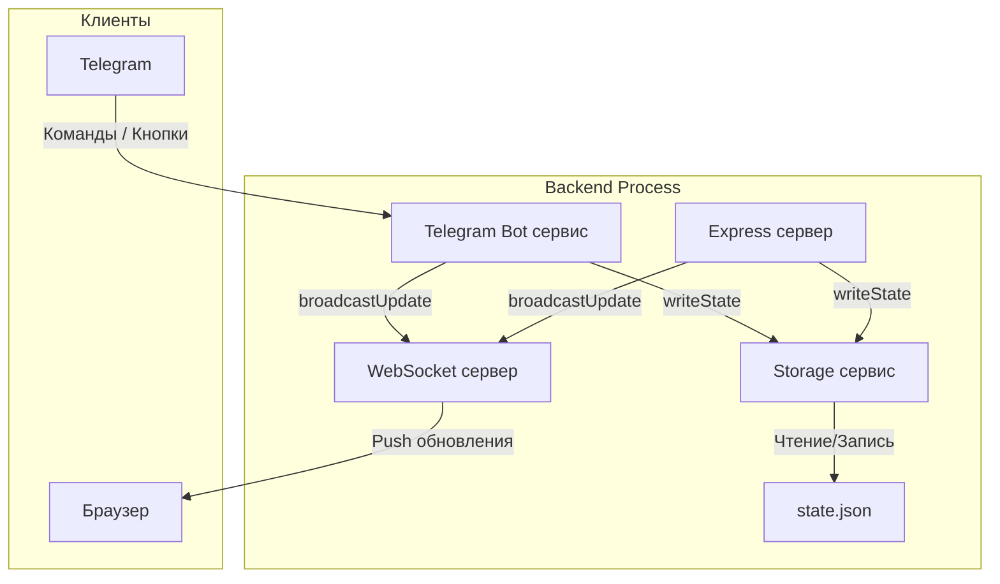
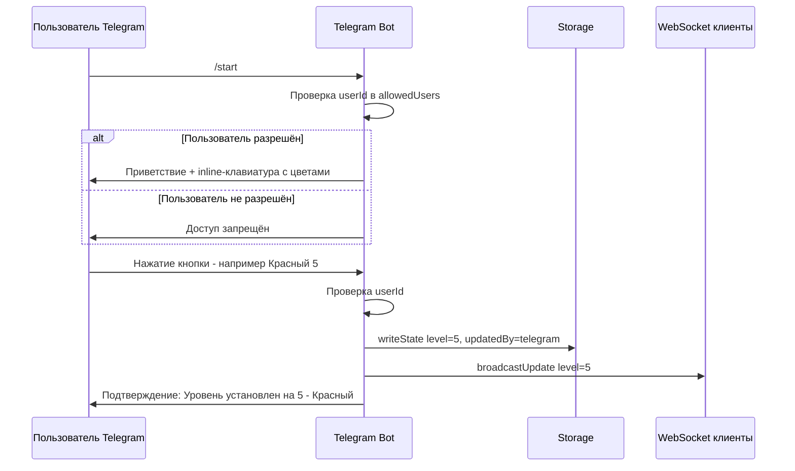

# Telegram-бот для Чувствометра — План реализации

## Обзор

Telegram-бот встраивается в бэкенд-модуль как сервис, работающий в том же процессе, что и Express + WebSocket сервер. Бот напрямую использует `storage.ts` для записи состояния и `broadcastUpdate()` для рассылки обновлений через WebSocket.

## Архитектура интеграции



## Поток взаимодействия с ботом



## Библиотека

**`node-telegram-bot-api`** — самая популярная библиотека для Telegram Bot API в Node.js.

- npm: https://www.npmjs.com/package/node-telegram-bot-api
- Типы: `@types/node-telegram-bot-api`
- Режим работы: **polling** (long polling) — не требует публичного URL/webhook, проще для VPS

## Новые файлы и изменения

### Новые файлы

| Файл | Описание |
|------|----------|
| `backend/src/services/telegram.ts` | Основной сервис Telegram-бота |

### Изменяемые файлы

| Файл | Что меняется |
|------|-------------|
| `backend/src/types/index.ts` | Добавление `TelegramConfig` в `AppConfig` |
| `backend/src/config.ts` | Чтение `TELEGRAM_BOT_TOKEN` и `TELEGRAM_ALLOWED_USERS` из env |
| `backend/src/index.ts` | Инициализация бота при старте сервера |
| `backend/.env.example` | Добавление переменных для Telegram |
| `backend/package.json` | Добавление зависимостей |

## Детали реализации

### 1. Переменные окружения

```env
# Telegram Bot
TELEGRAM_BOT_TOKEN=123456:ABC-DEF1234ghIkl-zyx57W2v1u123ew11
TELEGRAM_ALLOWED_USERS=123456789,987654321
```

- `TELEGRAM_BOT_TOKEN` — токен от @BotFather (обязательный для запуска бота)
- `TELEGRAM_ALLOWED_USERS` — список Telegram user ID через запятую (обязательный)

### 2. Обновление типов — `types/index.ts`

Добавить в `AppConfig`:

```typescript
telegram: {
  botToken: string;
  allowedUsers: number[];
} | null;  // null если бот не настроен
```

### 3. Обновление конфигурации — `config.ts`

Telegram-бот опционален: если `TELEGRAM_BOT_TOKEN` не задан, бот не запускается. Это позволяет запускать бэкенд без бота в dev-окружении.

```typescript
telegram: process.env['TELEGRAM_BOT_TOKEN']
  ? {
      botToken: process.env['TELEGRAM_BOT_TOKEN'],
      allowedUsers: (process.env['TELEGRAM_ALLOWED_USERS'] ?? '')
        .split(',')
        .map(id => parseInt(id.trim(), 10))
        .filter(id => !isNaN(id)),
    }
  : null,
```

### 4. Сервис Telegram-бота — `services/telegram.ts`

#### Основная логика:

1. **Инициализация**: Создание экземпляра бота в режиме polling
2. **Авторизация**: Middleware-проверка `msg.from.id` против списка `allowedUsers`
3. **Команда `/start`**: Отправляет приветствие и inline-клавиатуру с 7 кнопками цветов
4. **Callback query**: Обработка нажатий на кнопки — установка уровня

#### Inline-клавиатура:

Кнопки расположены в виде сетки. Каждая кнопка содержит эмодзи цвета и название:

```
[⚪ Серый 1] [🤍 Белый 2]
[💛 Жёлтый 3] [🧡 Оранжевый 4]
[❤️ Красный 5] [💗 Малиновый 6]
[🍓 Клубничный 7]
```

Callback data формат: `set_level_N` (например `set_level_5`)

#### Обработка нажатия кнопки:

1. Парсинг `callback_data` → извлечение уровня
2. Проверка авторизации пользователя
3. Вызов `writeState()` с `updatedBy: 'telegram'`
4. Вызов `broadcastUpdate()` для рассылки через WebSocket
5. Ответ пользователю: `answerCallbackQuery` + обновление сообщения с текущим уровнем

#### Команда `/level`:

Показывает текущий уровень (для удобства, хотя основная задача — изменение).

#### Graceful shutdown:

При `SIGTERM`/`SIGINT` — остановка polling.

### 5. Интеграция в `index.ts`

```typescript
import { initTelegramBot, stopTelegramBot } from './services/telegram';

// После инициализации WebSocket
if (config.telegram) {
  initTelegramBot();
}

// В обработчиках shutdown
stopTelegramBot();
```

### 6. Зависимости

```bash
npm install node-telegram-bot-api
npm install -D @types/node-telegram-bot-api
```

## Безопасность

- **Фильтр по user ID**: Только пользователи из `TELEGRAM_ALLOWED_USERS` могут взаимодействовать с ботом
- **Неавторизованные пользователи**: Получают сообщение «Доступ запрещён» и игнорируются
- **Токен бота**: Хранится в `.env`, не коммитится в репозиторий (уже в `.gitignore`)
- **Polling режим**: Не требует открытия дополнительных портов

## Деплой

- Бот запускается автоматически вместе с бэкендом
- PM2 перезапустит процесс при падении
- Не требуется отдельный процесс или конфигурация Nginx
- Нужно добавить `TELEGRAM_BOT_TOKEN` и `TELEGRAM_ALLOWED_USERS` в `.env` на VPS
